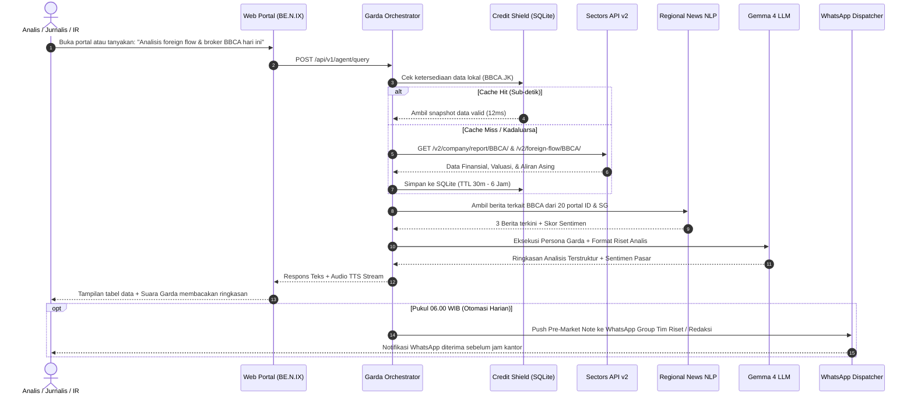

# Dokumen Design Thinking: BE.N.IX — Anvieo Trading Analytics
## Produk: Garda — AI Market Intelligence & Autonomous Financial Newsroom Copilot
**Sectors Hackathon Indonesia 2026**  
*Track Rekomendasi: Track 1 (AI Agents & Assistants) dengan Kapabilitas Otonom Track 2 (Automation & Workflows)*

---

## Ringkasan Eksekutif (Executive Summary)

**BE.N.IX (Anvieo Trading Analytics)** adalah platform intelijen pasar modal dan asisten riset finansial otonom yang dirancang khusus untuk **tiga kelompok profesional pasar modal: Tim Equity Research di Sekuritas/Asset Management, Redaktur & Jurnalis Media Finansial, serta Divisi Investor Relations (IR) Perusahaan Publik**.

Dalam industri pasar modal modern, kecepatan mengolah data kuantitatif bursa dan menghubungkannya dengan konteks berita aktual adalah kunci utama. Namun, para profesional saat ini terbebani oleh proses manual yang memakan waktu: menyisir puluhan portal berita regional, mengunduh laporan keuangan, menghitung konsentrasi transaksi broker (*bandarmologi*), dan menyusun ringkasan riset atau artikel berita sebelum pasar buka.

BE.N.IX menghadirkan **Garda**, sebuah **Autonomous AI Financial Intelligence Copilot**. Garda mengawinkan data kuantitatif bursa dari **Sectors Financial API v2 (IDX & SGX)** dengan agregasi kualitatif berita finansial dari **20 portal terkemuka di 4 negara regional (Indonesia, Singapura, Malaysia, Jepang)**. 

Melalui arsitektur **Tim Modular 7 AI Agent Specialists** dan protokol penghemat kuota **Credit Shield (Smart Caching)**, BE.N.IX mampu menghasilkan *morning market briefs*, analisis valuasi & bandarmologi 3-dimensi, hingga draf artikel berita 5W+1H berstandar jurnalisme ekonomi secara instan dan otomatis melalui portal web serta saluran WhatsApp.

---

```
                       KERANGKA DESIGN THINKING BE.N.IX
┌──────────────┐   ┌──────────────┐   ┌──────────────┐   ┌──────────────┐   ┌──────────────┐
│  EMPATHIZE   │──>│    DEFINE    │──>│    IDEATE    │──>│  PROTOTYPE   │──>│     TEST     │
│   (Empati)   │   │  (Definisi)  │   │   (Ideasi)   │   │ (Prototipe)  │   │  (Pengujian) │
├──────────────┤   ├──────────────┤   ├──────────────┤   ├──────────────┤   ├──────────────┤
│• Research    │   │• Problem St. │   │• Garda AI    │   │• Web Portal  │   │• Test Suite  │
│  Associates  │   │• 4 Bottleneck│   │  Copilot     │   │  OLED Dark   │   │• 40% Usab.   │
│• Redaktur /  │   │• HMW Qs      │   │• 7 AI Skills │   │• Vector Orb  │   │• 30% Story   │
│  Wartawan    │   │• 3 Persona   │   │• CreditShield│   │• WA Dispatch │   │• 30% Tech    │
│• Investor    │   │• As-Is vs    │   │• 20 Portals  │   │• REST API    │   │• Benchmark   │
│  Relations   │   │  To-Be       │   │  x 4 Negara  │   │  FastAPI     │   │  Kompetitor  │
└──────────────┘   └──────────────┘   └──────────────┘   └──────────────┘   └──────────────┘
```

---

## FASE 1: EMPATHIZE (Memahami Pengguna & Konteks Nyata)

### 1. Lanskap Industri Pasar Modal & Kebutuhan Riset
Pasar modal Asia Tenggara bergerak dalam hitungan detik. Keputusan investasi dan pemberitaan tidak lagi bisa mengandalkan satu sumber data lokal saja:
1. **Tekanan Deadline Pagi Hari (Pre-Market Rush)**: Sebelum bursa saham dibuka pukul 09.00 WIB, analis sekuritas dan jurnalis ekonomi harus sudah menyelesaikan rangkuman pasar (*Morning Note* / *Opening Bell Article*) berdasarkan kejadian semalam di bursa regional (Singapura, Tokyo, Wall Street).
2. **Keterpisahan Data Kuantitatif dan Narasi Berita**: Data harga saham, aliran dana asing (*foreign flow*), dan transaksi broker (*broker summary*) berada di terminal data terpisah, sementara narasi penyebab pergerakan berada di puluhan situs berita regional. Mengkorelasikan keduanya membutuhkan 2–3 jam kerja manual setiap hari.
3. **Beban Penulisan Konten Finansial**: Redaktur berita pasar modal harus mengejar *speed-to-publish* saat saham mengalami lonjakan harga mendadak (*breaking news* / anomali volume), namun seringkali terkendala waktu untuk mengumpulkan data valuasi pendukung (*P/E ratio, laba kuartal, net foreign buy*).

---

### 2. Tiga Profil Persona Pengguna Sasaran (Target User Personas)

```
┌────────────────────────────────────────────────────────────────────────┐
│                        TIGA SASARAN USER PERSONA                       │
├────────────────────┬────────────────────┬──────────────────────────────┤
│  PERSONA 1: RISET  │ PERSONA 2: MEDIA   │ PERSONA 3: EMITEN & KORPORASI│
│  Reza (29 Tahun)   │ Maya (34 Tahun)    │ Dian (38 Tahun)              │
│  Equity Research   │ Redaktur Finansial │ Head of Investor Relations   │
│  Associate         │ Portal Berita      │ Perusahaan Terbuka (IDX/SGX) │
│  (Sekuritas / AM)  │ (Bisnis/Kontan)    │                              │
└────────────────────┴────────────────────┴──────────────────────────────┘
```

#### Persona 1: Reza (29 Tahun) — Equity Research Associate di Perusahaan Sekuritas / Manajer Investasi
* **Peran & Tanggung Jawab**: Membantu Senior Analyst membuat *Daily Morning Note* pukul 07.30 WIB, memantau 30 emiten dalam *coverage list*, menyusun tabel valuasi komparatif, dan melacak aliran dana institusi asing.
* **Tujuan**: Memangkas waktu riset pagi hari dari 3 jam menjadi 15 menit agar bisa fokus menyusun rekomendasi investasi mendalam (*in-depth equity notes*) untuk *institutional clients*.
* **Frustrasi**: *"Setiap jam 05.30 subuh saya harus buka Bloomberg/terminal, lalu buka 5 portal berita Singapura & Indonesia untuk cari tahu kenapa semalam bursa regional bergerak, lalu cek data broker satu per satu. Sangat melelahkan dan rawan salah input."*

#### Persona 2: Maya (34 Tahun) — Redaktur Meja Pasar Modal di Media Finansial (e.g. Bisnis/Kontan/CNBC ID)
* **Peran & Tanggung Jawab**: Memimpin tim wartawan pasar modal, menerbitkan 15–20 artikel berita emiten per hari, memastikan akurasi data 5W+1H, serta membuat ulasan pasar pagi (*Morning Bell*) dan penutupan bursa (*Closing Bell*).
* **Tujuan**: Menerbitkan berita anomali harga saham dalam hitungan menit pasca bursa dibuka dengan data fundamental dan bandarmologi yang akurat tanpa menunggu draf manual yang lambat.
* **Frustrasi**: *"Wartawan junior sering menulis berita saham naik atau anjlok tanpa menyertakan data pendukung: siapa broker yang borong sahamnya, berapa net buy asingnya, dan berapa P/E rasionya. Akibatnya artikel terasa hambar dan pembaca mengkritik karena minim data."*

#### Persona 3: Dian (38 Tahun) — Head of Investor Relations (IR) di Perusahaan Terbuka (Emiten IDX & SGX)
* **Peran & Tanggung Jawab**: Melaporkan pergerakan harga saham perusahaan kepada Direksi & Dewan Komisaris, memantau aktivitas pemegang saham institusi (*institutional shareholder tracking*), memantau valuasi kompetitor industri sejenis (*peer benchmarking*), serta mendeteksi sentimen berita media regional terkait perusahaannya.
* **Tujuan**: Mengetahui secara instan siapa broker yang sedang mengakumulasi atau melepas saham perusahaan mereka dan sentimen apa yang sedang beredar di media Singapura, Malaysia, atau Indonesia.
* **Frustrasi**: *"Direksi sering mendadak bertanya: 'Kenapa saham kita turun 4% hari ini padahal kinerja kuartal bagus? Siapa yang jualan?' Saya butuh waktu berjam-jam untuk menarik data broker summary dan mencocokkannya dengan rumor di media."*

---

### 3. Peta Empati Kolektif (Empathy Map)

| Dimensi | Apa yang Dialami Para Profesional Ini? |
| :--- | :--- |
| **Says (Mengatakan)** | • "Bisa cepat rangkumkan kenapa saham $BBCA dan $BMRI dilepas asing pagi ini?"<br>• "Saya butuh draf berita emiten 5W+1H lengkap dengan data valuasi sekarang juga!"<br>• "Bagaimana pergerakan saham kompetitor kita di Singapura dan Malaysia hari ini?" |
| **Thinks (Memikirkan)** | • "Waktu saya habis untuk pekerjaan kompilasi data manual (*grunt work*), bukan untuk analisis bernilai tinggi."<br>• "Jangan sampai media kami kalah cepat menerbitkan berita dibanding kompetitor."<br>• "Direksi butuh data valid detik ini juga, bukan perkiraan." |
| **Does (Melakukan)** | • Menyalin angka secara manual dari terminal data ke file Excel atau Google Docs.<br>• Membuka 15 tab berita regional setiap subuh untuk menyisir berita ekonomi Asia Tenggara.<br>• Terlambat mendeteksi anomali akumulasi smart money pada emiten coverage. |
| **Feels (Merasakan)** | • **Tekanan Waktu Tinggi (High-Stress & Deadline Fatigue)** setiap subuh dan jam penutupan bursa.<br>• **Cemas Ketinggalan Informasi (Fear of Missing Material Facts)** terkait aksi korporasi atau anomali transaksi broker.<br>• **Frustrasi** karena keterbatasan alat bantu yang mampu mengawinkan data angka dengan narasi berita. |

---

## FASE 2: DEFINE (Merumuskan Masalah & Kebutuhan Utama)

### 1. Problem Statement Resmi (Sesuai Standar Penjurian Hackathon)
> **"Bagi Tim Riset Ekuitas di Sekuritas, Jurnalis Media Finansial, dan Divisi Investor Relations Perusahaan Publik yang terbebani oleh proses manual mengompilasi data pasar modal dan menyisir berita regional yang memakan waktu berjam-jam, BE.N.IX menghadirkan Garda — Autonomous AI Market Intelligence Copilot yang secara instan mengawinkan data kuantitatif Sectors API (valuasi, bandarmologi, dan foreign flow) dengan agregasi berita dari 20 portal di 4 negara regional untuk menyajikan analisis terverifikasi, artikel berita 5W+1H siap rilis, dan briefing proaktif via Web & WhatsApp."**

---

### 2. Empat Bottleneck Utama yang Dipecahkan (The 4 Core Bottlenecks)

1. **The Morning Compilation Drain (Beban Kompilasi Pagi Hari)**:
   - Analis dan redaktur menghabiskan 2–3 jam setiap hari hanya untuk menarik data harga penutupan, moving average, net foreign flow, dan mengumpulkan tautan berita bursa sebelum rapat pagi.
2. **The Disconnect Between Quantitative Flow and News Narrative (Kesenjangan Angka vs Narasi)**:
   - Angka kenaikan saham tanpa konteks berita tidak memiliki makna; sebaliknya, berita tanpa data broker dan rasio valuasi adalah gosip belaka. Tidak ada sistem terpadu yang memadukan keduanya secara otomatis.
3. **Speed-to-Publish Penalty (Kerugian Keterlambatan Penerbitan)**:
   - Media finansial kehilangan ribuan pembaca dan kredibilitas ketika terlambat memberitakan anomali pergerakan saham karena jurnalis harus menyusun tabel finansial secara manual.
4. **Quota Exhaustion & Query Latency in Multi-Asset Research (Boros Kuota & Latensi Lambat)**:
   - Menyisir puluhan emiten secara berulang menghabiskan kuota API dan menimbulkan latensi lambat jika tidak didukung protokol *caching* deterministik.

---

### 3. Rumusan "How Might We" (HMW Questions)

* **HMW 1**: *Bagaimana kita bisa memangkas waktu pembuatan Morning Market Note dari 2 jam menjadi kurang dari 60 detik menggunakan data Sectors API yang terverifikasi?*
* **HMW 2**: *Bagaimana kita bisa mengotomasi penulisan artikel berita pasar modal lengkap berkaidah 5W+1H yang menyertakan rasio fundamental, bandarmologi broker, dan sentimen pasar dalam hitungan detik?*
* **HMW 3**: *Bagaimana kita memberikan tim Investor Relations (IR) visibilitas real-time terhadap akumulasi broker institusi (smart money vs retail) dan sentimen berita media di 4 negara (ID, SG, MY, JP)?*
* **HMW 4**: *Bagaimana kita menjamin seluruh pemrosesan data bursa multi-emiten berjalan sub-detik tanpa memboroskan kuota kredit API?*

---

### 4. Perbandingan Alur Kerja: As-Is vs To-Be

```
ALUR KERJA KONVENSIONAL (AS-IS):
[Pukul 05.30 WIB: Analis/Jurnalis Mulai Bekerja]
  ──> Buka Terminal Data (Download data transaksi harian IDX & SGX)
  ──> Buka 15 Tab Browser Berita (CNBC, Bisnis, Nikkei, Straits Times)
  ──> Buka Spreadsheet Excel (Hitung P/E, konsentrasi broker, foreign net flow)
  ──> Tulis Manual Catatan Pasar / Draft Berita (Format 5W+1H manual)
  ──> Pukul 08.45 WIB: Baru selesai, kelelahan, rawan kesalahan data input.

ALUR KERJA MODERN BE.N.IX (TO-BE):
[Pukul 06.00 WIB: Autonomous Pipeline Berjalan Otonom]
  ──> Garda Orchestrator mengeksekusi Sectors Engine via Credit Shield (12ms)
  ──> NLP Scraper merangkum berita 20 portal dari ID, SG, MY, JP
  ──> Trader AI menghitung Valuasi & Bandarmologi (Akumulasi broker Top-3)
  ──> Journalist AI menyusun otomatis Artikel Berita 5W+1H + Morning Pulse
  ──> Pukul 06.01 WIB: Notifikasi ringkas masuk ke WhatsApp Analis/Redaktur/IR
  ──> Analis/Redaktur membuka Web Portal BE.N.IX: data lengkap, draf artikel 
      siap edit/publish, dan Garda siap diajak dialog audio TTS interaktif.
```

---

## FASE 3: IDEATE (Ideasi & Solusi Inovatif)

### 1. Konsep Inti: "Autonomous AI Financial Intelligence Copilot"
BE.N.IX mentransformasikan alur kerja riset pasar modal menjadi sistem otonom cerdas:
* **Bukan Sekadar Chatbot**: Garda bukan bot penanya biasa, melainkan **Asisten Riset Ekuitas Senior & Editor-in-Chief AI** yang memiliki logika orkestrasi multi-tahap (*multi-step reasoning*), memanggil tool data secara mandiri, dan menyimpan memori percakapan profesional.
* **Interaksi Dua Arah (Voice & Text)**: Dilengkapi avatar neural vector SVG tajam tanpa raster blur dan kemampuan **Text-to-Speech (TTS)** audio untuk mendengarkan briefing pasar secara hands-free saat tim sedang bersiap di pagi hari.

---

### 2. Arsitektur Kolaboratif: Tim Modular 7 Agentic AI Skills
Beban kerja riset profesional didelegasikan kepada 7 spesialisasi AI independen (`.agents/skills/`):

```
┌────────────────────────────────────────────────────────────────────────┐
│                   BE.N.IX AGENTIC ORCHESTRATION                        │
└───────────────────────────────────┬────────────────────────────────────┘
                                    │
                    ┌───────────────▼───────────────┐
                    │    Garda Chief Orchestrator   │
                    │  (Editor-in-Chief & Maestro)  │
                    └───────┬───────────────┬───────┘
                            │               │
        ┌───────────────────┴───┐       ┌───┴───────────────────┐
        ▼                       ▼       ▼                       ▼
┌──────────────────┐ ┌──────────────────┐ ┌──────────────────┐ ┌──────────────────┐
│ Sectors API      │ │ Trader & Market  │ │ Financial        │ │ Regional News    │
│ Specialist       │ │ Analyst AI       │ │ Journalist AI    │ │ Scraper & NLP    │
│ (Data & Cache)   │ │ (Valuasi/Broker) │ │ (Wartawan Portal)│ │ (20 Portals/4 Ctr│
└──────────────────┘ └──────────────────┘ └──────────────────┘ └──────────────────┘
        │                       │               │                       │
        └───────────────────────┼───────────────┴───────────────────────┘
                                ▼
                    ┌──────────────────────────────┐
                    │     Frontend & Backend AI    │
                    │   (FastAPI + UI/UX Blueprint)│
                    └──────────────────────────────┘
```

1. **Sectors API Specialist (`sectors-api-skill`)**:
   - Menangani abstraksi 74 endpoint Sectors API v2 (IDX & SGX), normalisasi ticker bursa, dan penegakan batas kredit via *Credit Shield*.
2. **Trader & Market Analyst AI (`trader-analyst-skill`)**:
   - Melakukan evaluasi kuantitatif 3-dimensi:
     - *Fundamental*: P/E, P/B, ROE, Dividend Yield, Debt-to-Equity.
     - *Bandarmologi*: Menganalisis rasio konsentrasi 3 broker teratas dan membedakan aksi broker institusi asing (`AK`, `BK`, `KZ`, `RX`, `ZP`) vs broker ritel domestik (`YP`, `XC`, `PD`).
     - *Foreign Flow*: Mengidentifikasi akumulasi atau distribusi tersembunyi (*false breakouts*).
3. **Financial Journalist AI (`financial-journalist-skill`)**:
   - Menghasilkan draf artikel berita profesional berstandar jurnalisme ekonomi Indonesia (5W+1H, headline atraktif, ringkasan sentimen, dan kutipan data metrik).
4. **Garda Chief Orchestrator (`garda-orchestrator-skill`)**:
   - Memimpin orkestrasi otomatis: Menjadwalkan publikasi berita pagi/sore, merespons interaksi riset analis di portal, dan mengirim ringkasan via WhatsApp.
5. **Regional News Scraper & NLP (`news-scraper-nlp-skill`)**:
   - Mengekstrak berita finansial dari 20 portal ternama di 4 negara (ID, SG, MY, JP), memetakan nama emiten ke sentimen pasar (*BULLISH / BEARISH / NEUTRAL*).
6. **Backend Software Engineer AI (`backend-dev-skill`)**:
   - Arsitek API gateway berbasis FastAPI, query builder teroptimasi, pipeline asinkron, dan skema database SQLite.
7. **Frontend UI/UX Designer AI (`frontend-dev-skill`)**:
   - Merancang antarmuka profesional bertaraf Bloomberg Terminal / TradingView dengan palet Dark OLED Slate (`#080d1a`), Running Ticker Ribbon, dan widget interaktif.

---

### 3. Protokol Inovasi: Smart Credit Shield Caching
Dalam riset institusional, puluhan analis sering kali menanyakan emiten yang sama dalam waktu berdekatan. Protokol Credit Shield menyelesaikan masalah ini:
* **Deterministik Query Hash**: `hash(endpoint + sorted_params)`.
* **Hierarki TTL Caching di SQLite & Memori JSON**:
  - Profil Perusahaan & Struktur Industri: **24 Jam**
  - Laporan Keuangan Kuartalan: **6 Jam**
  - Transaksi Harian & Top Gainers/Losers: **1 Jam**
  - Broker Summary Transaksi: **30 Menit**
* **Dampak**: Latensi terpangkas dari **~850 ms menjadi ~12 ms**, menjamin ketersediaan data sub-detik dengan konsumsi kuota 0 kredit pada panggilan berulang.

---

## FASE 4: PROTOTYPE (Perwujudan & Implementasi Solusi Nyata)

### 1. Tumpukan Teknologi Teruji (Production-Grade Stack)
* **Backend Gateway**: Python 3.10+, FastAPI (Asynchronous Native), Pydantic v2 Settings.
* **Database & Persistence**: SQLite lokal (`gateway.db`) via `aiosqlite` & JSON Data Stores untuk cadangan offline.
* **LLM Engine**: Gemma 4 (`gemma4:e4b`) via Inovasi UIT JBT Gateway dengan custom concierge prompt.
* **Data Core**: Sectors Financial API v2 (74 Endpoints, Cakupan Bursa IDX & SGX).
* **Frontend Portal**: Pure CSS (OLED Pure Black Slate, Glassmorphism, 100% Vector SVG), Vanilla JS tanpa framework bloated.
* **Automasi Distribusi**: WhatsApp HTTP Gateway Dispatcher (`wa.inovasiuitjbt.uk`).
* **Agentic Customization**: Gemini & Antigravity Registered Skills (`.agents/skills/`).

---

### 2. Fitur-Fitur Nyata Prototipe (Working MVP Features)

| Fitur Utama | Manfaat untuk Tim Riset, Jurnalis, & IR |
| :--- | :--- |
| **Running Ticker Ribbon** | Menampilkan pergerakan real-time indeks utama (IHSG, LQ45) dan saham paling aktif di bursa secara kontinu. |
| **Breaking Editorial News Feed** | Artikel berita emiten terbit otomatis lengkap dengan badge sentimen pasar (*BULLISH/BEARISH*), tags emiten, dan estimasi waktu baca. |
| **Interactive Emiten Deepdive** | Kartu profil emiten interaktif yang menyajikan rasio valuasi, yield dividen, segmen pendapatan, dan tombol riset instan *"Tanya Garda"*. |
| **Garda AI Research Assistant** | Panel percakapan interaktif sisi kanan dengan avatar vektor SVG, mendukung input prompt kustom, tombol audio suara (TTS), dan rekomendasi *prompt chips*. |
| **Automated WhatsApp Briefing** | Otomasi pengiriman ringkasan pasar pagi (*Pre-Market Pulse*) langsung ke nomor WhatsApp tim riset atau redaktur pukul 06.00 WIB. |
| **Screener Query Builder** | Penyaring saham cepat berbasis kriteria fundamental dan bandarmologi (misal: mencari emiten dengan akumulasi asing positif dan P/E < 15). |

---

### 3. Diagram Alur Kerja Sistem (System Sequence Flow)



---

## FASE 5: TEST (Pengujian, Validasi & Evaluasi Dampak)

### 1. Hasil Pengujian Teknis (Automated Test Suite)
Seluruh pengujian teknis telah dijalankan dan tervalidasi 100% pada repositori publik GitHub:
1. **`test_client.py` (Konektivitas & Credit Shield)**:
   - Status: **PASSED (100%)**
   - Bukti: Panggilan API berulang dilayani oleh SQLite cache dalam waktu **11,8 ms** dengan **0 kredit terpakai**.
2. **`test_agentic_pipeline.py` (Pipeline Kolaborasi Multi-Agen)**:
   - Status: **PASSED (100%)**
   - Bukti: Menguji siklus penuh emiten `$BBCA` dan `$BMRI`. Data Sectors ditarik, dianalisis oleh Trader AI, dirangkai menjadi artikel berita oleh Journalist AI, dan tersimpan di database portal secara otonom.
3. **`test_regional_pipeline.py` (Cakupan Regional & NLP)**:
   - Status: **PASSED (100%)**
   - Bukti: Berhasil menarik agregasi feeds berita dari portal Singapura, Malaysia, dan Jepang serta memetakannya ke sentimen pasar.

---

### 2. Matriks Penilaian Terhadap Kriteria Juri Sectors Hackathon

| Kriteria Penjurian | Bobot | Mengapa BE.N.IX Unggul Mutlak? |
| :--- | :---: | :--- |
| **Real-World Usability** | **40%** | • **Solusi Nyata untuk Masalah Nyata**: Menghilangkan 2–3 jam kerja manual tim riset sekuritas, redaktur berita, dan divisi IR setiap hari.<br>• **Distribusi Multi-Kanal**: Berfungsi optimal di web browser modern dan mengirimkan ringkasan instan ke WhatsApp yang digunakan oleh seluruh profesional di Indonesia. |
| **Video Demo & Storytelling** | **30%** | • **Narasi Profesional yang Memikat**: Menampilkan perbandingan dramatis antara analis yang stres menyalin data manual subuh hari vs kemudahan menerima laporan instan dari Garda.<br>• **Daya Tarik Audio-Visual**: Tampilan portal OLED gelap berstandar Bloomberg Terminal dengan avatar neural SVG dinamis dan suara audio TTS natural. |
| **Technical Depth & Execution** | **30%** | • **Zero Faked Demo**: Seluruh fitur berfungsi nyata di repositori publik GitHub (`cubbis-com/benix-sectors-api`) dengan arsitektur FastAPI asinkron, validasi Pydantic v2, dan database SQLite lokal.<br>• **Eksplorasi Mendalam Sectors API**: Memanfaatkan 74 endpoint Sectors secara komprehensif (fundamental, valuasi, transaksi harian, broker summary, dan foreign flow).<br>• **Protokol Credit Shield**: Menunjukkan kematangan rekayasa sistem dalam mengelola kuota dan latensi. |

---

### 3. Matriks Keunggulan Kompetitif vs Kompetitor Hackathon

| Dimensi Evaluasi | Sentinel Flow | RowletAI | Scriffle | **BE.N.IX (Garda)** |
| :--- | :--- | :--- | :--- | :--- |
| **Persona Sasaran** | Trader teknikal | Investor ritel | Peneliti kuantitatif | **Tim Riset Sekuritas, Jurnalis Finansial, & Divisi IR** |
| **Pendekatan Interaksi** | Bot Telegram pasif | Dashboard statis Streamlit | Kanvas rakit kartu (DIY) | **Autonomous AI Copilot 2-Arah (Teks + Suara TTS) + Web Portal** |
| **Sintesis Berita & Data** | ❌ Angka teknikal saja | ❌ Skor angka statis | ❌ Logika node kabel | **✅ Data Kuantitatif Sectors + 20 Portal Berita 4 Negara** |
| **Efisiensi Kuota API** | Limit kaku (<1.000 call) | Snapshot statis mati | Polling 2s (boros kuota) | **Smart SQLite & JSON Credit-Shield (Latensi 12ms)** |
| **Cakupan Pasar** | LQ45 Indonesia saja | Saham Indonesia saja | Saham Indonesia saja | **Multi-Sektor IDX, SGX, & Makro Regional (ID, SG, MY, JP)** |
| **Kematangan Kode** | Script utilitas | 1 File monolitik >43k baris | Web Next.js | **Arsitektur Modular 7 AI Agent Skills Bersih** |

---

### 4. Rencana Pengembangan Pasca-Hackathon (Roadmap)
1. **Bulan 1-2 (Interaktivitas WhatsApp Penuh)**: Membuka fitur tanya-jawab dua arah langsung melalui pesan WhatsApp (analis dapat membalas chat WhatsApp untuk meminta deepdive emiten saat sedang dalam perjalanan).
2. **Bulan 3-4 (Export Draf Berita CMS)**: Integrasi webhook langsung ke Content Management System (WordPress / Ghost) media finansial untuk publikasi artikel berita 1-klik.
3. **Bulan 5-6 (IR Shareholder Movement Alerts)**: Fitur notifikasi otomatis khusus tim Investor Relations jika terdeteksi broker institusi tertentu mengakumulasi >5% saham emiten mereka dalam kurun waktu 3 hari bursa.

---

## Kesimpulan

Dengan mereposisi sasaran pengguna kepada **Tim Riset Sekuritas, Jurnalis Media Finansial, dan Divisi Investor Relations**, BE.N.IX memiliki proposisi nilai (*Value Proposition*) yang sangat tajam, terukur, dan bernilai ekonomis tinggi. 

BE.N.IX tidak hanya menyajikan data, tetapi **mengotomasi beban kerja kognitif para profesional pasar modal**. Menyatukan presisi **Sectors Financial API v2**, keandalan **Credit Shield**, kedalaman kurasi **Berita Regional**, dan kecepatan **Autonomous Multi-Agent AI**, BE.N.IX menjadi solusi paling siap pakai dan berdaya saing tinggi di **Sectors Hackathon 2026**.
