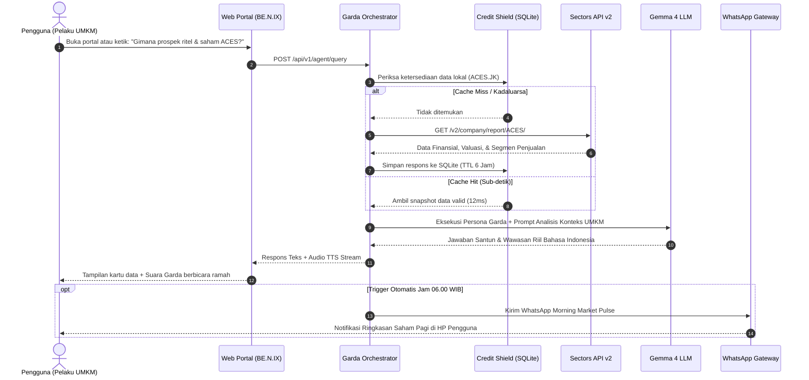

# Dokumen Design Thinking: BE.N.IX — Anvieo Trading Analytics
## Produk: Garda — AI Market Concierge & Regional News Intelligence
**Sectors Hackathon Indonesia 2026**  
*Track Rekomendasi: Track 1 (AI Agents & Assistants) dengan Kapabilitas Otonom Track 2 (Automation & Workflows)*

---

## Ringkasan Eksekutif (Executive Summary)

**BE.N.IX (Anvieo Trading Analytics)** adalah platform kecerdasan pasar modal dan asisten penasihat bisnis berbasis AI yang dirancang untuk **pelaku usaha UMKM, pengusaha sektor riil, dan investor ritel Indonesia**. 

Berbeda dari aplikasi bursa konvensional yang menyajikan tumpukan angka teknikal tanpa konteks, BE.N.IX menghadirkan **Garda**, sebuah **AI Market Concierge berstandar layanan hotel bintang lima**. Garda mengawinkan data kuantitatif bursa dari **Sectors Financial API v2** dengan kurasi kualitatif berita finansial dari **20 portal terkemuka di 4 negara regional (Indonesia, Singapura, Malaysia, Jepang)**. 

Didukung oleh arsitektur **Tim Modular 7 AI Agent Specialists** dan protokol penghemat kuota **Credit Shield (Smart Caching)**, BE.N.IX mentransformasikan data pasar saham menjadi wawasan bisnis praktis yang dapat langsung diterapkan untuk pengambilan keputusan rantai pasok, analisis daya beli industri, dan penanaman modal.

---

```
                       KERANGKA DESIGN THINKING BE.N.IX
┌──────────────┐   ┌──────────────┐   ┌──────────────┐   ┌──────────────┐   ┌──────────────┐
│  EMPATHIZE   │──>│    DEFINE    │──>│    IDEATE    │──>│  PROTOTYPE   │──>│     TEST     │
│   (Empati)   │   │  (Definisi)  │   │   (Ideasi)   │   │ (Prototipe)  │   │  (Pengujian) │
├──────────────┤   ├──────────────┤   ├──────────────┤   ├──────────────┤   ├──────────────┤
│• Pelaku UMKM │   │• Problem St. │   │• Garda AI    │   │• Web Portal  │   │• Test Suite  │
│• Investor    │   │• 4 Pain Point│   │  Concierge   │   │  OLED Dark   │   │• 40% Usab.   │
│• Empathy Map │   │• HMW Qs      │   │• 7 AI Skills │   │• Vector Orb  │   │• 30% Story   │
│• Kesenjangan │   │• User Persona│   │• CreditShield│   │• WA Gateway  │   │• 30% Tech    │
│  Data Riil   │   │• As-Is vs    │   │• 20 Portals  │   │• REST API    │   │• Benchmark   │
│              │   │  To-Be       │   │  x 4 Negara  │   │  FastAPI     │   │  Kompetitor  │
└──────────────┘   └──────────────┘   └──────────────┘   └──────────────┘   └──────────────┘
```

---

## FASE 1: EMPATHIZE (Memahami Pengguna & Konteks Nyata)

### 1. Observasi Empiris Pasar Modal Indonesia
Berdasarkan data KSEI, jumlah investor pasar modal Indonesia telah melampaui 13 juta orang, didominasi oleh generasi muda dan pemilik usaha mandiri. Namun, terdapat kesenjangan besar antara ketersediaan data dengan pemahaman pengguna:
1. **Bahasa Pasar Terlalu Eksklusif**: Istilah seperti *P/E Ratio*, *Debt-to-Equity*, *Operating Cash Flow*, dan *Bandarmology Net Foreign Flow* terasa mengintimidasi dan sulit dipahami oleh orang awam.
2. **Ketiadaan Hubungan dengan Sektor Riil**: Pelaku UMKM tidak menyadari bahwa data bursa saham (misal: kinerja emiten ritel $ACES, konsumen pokok $ICBP, atau logistik $ASII) merupakan **cermin langsung dari daya beli masyarakat dan tren industri mereka sendiri**.
3. **Informasi Terfragmentasi**: Investor harus membuka puluhan tab browser untuk membaca berita di CNBC Indonesia, Bisnis.com, dan Kontan, lalu membandingkannya manual dengan grafik harga saham yang sedang anjlok atau naik.

---

### 2. Profil Persona Pengguna (User Personas)

#### Persona A: Pak Hendra (48 Tahun) — Pemilik Pabrik & Distributor Bahan Bangunan
* **Karakter**: Berpengalaman 20 tahun di bisnis riil, tidak punya latar belakang pendidikan finansial, memegang smartphone untuk koordinasi WhatsApp dan cek berita sesaat.
* **Tujuan**: Ingin mengetahui apakah industri properti dan perumahan tahun 2026 sedang bergairah atau lesu agar bisa mengatur stok produksi semen dan bata ringan.
* **Frustrasi**: *"Saya pernah download aplikasi saham, tapi pusing lihat grafik lilin (candlestick) dan angka warna-warni. Saya cuma butuh tahu: pengembang perumahan lagi banyak proyek atau sepi? Jangan kasih saya PDF laporan keuangan 60 halaman!"*

#### Persona B: Anisa (28 Tahun) — Pemilik Coffee Shop & Investor Ritel Pemula
* **Karakter**: Generasi digital-native, memiliki tabungan yang ingin dialokasikan ke saham berdividen stabil (*dividend investing*), sering cemas akibat berita pasar yang sensasional (*FOMO/Panic Selling*).
* **Tujuan**: Mencari saham kebutuhan pokok yang sehat secara fundamental, rutin membagikan dividen >5%, dan ingin tahu alasan mengapa harga saham favoritnya tiba-tiba turun.
* **Frustrasi**: *"Kemarin saham bank saya turun 3%. Di media sosial ramai isu krisis, tapi di portal berita dibilang normal profit-taking. Saya tidak tahu mana yang benar karena tidak bisa membaca data transaksi asing dan broker."*

#### Persona C: Budi (35 Tahun) — Analis Bisnis & Trader Mandiri
* **Karakter**: Sangat melek data, membutuhkan kecepatan dalam merangkum berita makro regional (Singapura, Malaysia, Jepang) dan mengaitkannya dengan IHSG sebelum jam bursa buka pukul 09.00 WIB.
* **Tujuan**: Mendapatkan ringkasan *pre-market intelligence* yang terverifikasi tanpa harus membuang waktu 2 jam membaca puluhan situs berita setiap subuh.
* **Frustrasi**: *"Riset memakan waktu terlalu banyak. Saya butuh kurasi otomatis yang menyaring kebisingan pasar (market noise) dan langsung memberikan fakta data bursa + konfirmasi berita terkait."*

---

### 3. Peta Empati (Empathy Map)

| Dimensi | Apa yang Dialami Pengguna? |
| :--- | :--- |
| **Says (Mengatakan)** | • "Bahasanya susah banget dimengerti."<br>• "Gimana prospek bisnis saya kalau bursa lagi turun?"<br>• "Kenapa saham ini tiba-tiba anjlok padahal perusahaannya besar?" |
| **Thinks (Memikirkan)** | • "Apakah uang dan stok barang saya aman?"<br>• "Pasti data seperti ini cuma untuk orang kaya atau manajer investasi di Jakarta."<br>• "Saya butuh asisten pribadi yang bisa saya ajak ngobrol santai tanpa dihakimi." |
| **Does (Melakukan)** | • Mengambil keputusan bisnis hanya berdasarkan intuisi atau kabar angin grup WhatsApp.<br>• Membuka aplikasi bursa sebentar lalu menutupnya kembali karena bingung.<br>• Terlambat mengantisipasi lonjakan harga bahan baku industri. |
| **Feels (Merasakan)** | • **Kewalahan (Overwhelmed)** oleh ledakan data angka mentah.<br>• **Cemas (Anxious)** akan risiko kerugian modal atau penurunan omzet.<br>• **Tertinggal (Excluded)** dari informasi bernilai tinggi yang dinikmati investor institusi. |

---

## FASE 2: DEFINE (Merumuskan Masalah & Kebutuhan Utama)

### 1. Problem Statement Resmi (Sesuai Syarat Hackathon)
> **"Untuk pemilik usaha UMKM dan investor ritel Indonesia yang kewalahan mengolah data laporan keuangan bursa yang rumit dan berita pasar yang terfragmentasi, BE.N.IX menghadirkan Garda AI Market Concierge yang secara otomatis mengawinkan data kuantitatif Sectors API dengan kurasi berita regional untuk menyajikan wawasan bisnis dan investasi yang jelas, terverifikasi, dan bebas jargon melalui percakapan ramah dan otomasi harian."**

---

### 2. Empat Pain Points Utama (Root Causes)
1. **The Context Void (Ketiadaan Konteks Penyebab)**: Data pergerakan harga bursa tidak menjelaskan "mengapa" pergerakan itu terjadi. Tanpa integrasi berita riil, angka fluktuasi saham menjadi buta konteks.
2. **The SME-Market Disconnect (Kesenjangan UMKM dengan Pasar Modal)**: Pelaku usaha riil belum memiliki jembatan pemikiran untuk memanfaatkan data emiten terbuka sebagai alat *due diligence* vendor dan barometer daya beli masyarakat.
3. **Credit Quota Fragility (Kerentanan Kuota API)**: Aplikasi yang terus-menerus memanggil endpoint eksternal tanpa mekanisme caching pintar akan cepat kehabisan kuota kredit API dan memperlambat waktu respon (*high latency*).
4. **Intimidating User Interface (Antarmuka yang Mengintimidasi)**: Dashboard pasar modal umumnya kaku, penuh warna neon yang melelahkan mata, dan tidak memiliki sentuhan interaksi manusiawi.

---

### 3. Rumusan "How Might We" (HMW Questions)
* **HMW 1**: *Bagaimana kita bisa menerjemahkan metrik bursa yang rumit (P/E, ROE, Net Foreign Flow, Broker Summary) menjadi bahasa percakapan bisnis yang santun dan mudah dipahami oleh pemilik warung atau pabrik lokal?*
* **HMW 2**: *Bagaimana kita bisa mengawinkan lonjakan data kuantitatif Sectors API secara instan dengan kurasi artikel berita aktual dari 20 portal di 4 negara regional?*
* **HMW 3**: *Bagaimana kita mengamankan kuota kredit API yang terbatas agar sistem tetap responsif (sub-detik) dan hemat biaya melalui arsitektur caching lokal?*
* **HMW 4**: *Bagaimana kita mengantarkan wawasan pasar penting tersebut secara proaktif tanpa menuntut pengguna membuka dashboard setiap jam (misal: melalui WhatsApp)?*

---

### 4. Perbandingan Alur Pengguna: As-Is vs To-Be

```
ALUR LAMA (AS-IS):
[Bingung Tren Bisnis/Saham] 
  ──> Buka 10 Tab Berita Berbeda (Sensasional & Penuh Iklan)
  ──> Buka Laporan Keuangan PDF 50 Halaman (Pusing Membaca Angka)
  ──> Bertanya di Grup Sosmed (Mendapat Saran Menyesatkan / Pom-Pom)
  ──> Keputusan Ragu-Ragu & Rawan Rugi

ALUR BE.N.IX (TO-BE):
[Buka BE.N.IX Web / Terima Pesan WA]
  ──> Ticker Ribbon & Breaking News Editorial Tersaji Bersih
  ──> Klik / Tanya Garda: "Gimana industri properti & emiten semen sekarang?"
  ──> Garda Orchestrator mengecek Credit Shield Cache (12ms)
  ──> Garda menyintesis Data Sectors + Berita CNBC/Bisnis.com
  ──> Jawaban tersaji santun, ringkas, disertai audio TTS natural
  ──> Keputusan Bisnis & Investasi Terukur Berdasarkan Data Valid
```

---

## FASE 3: IDEATE (Ideasi & Solusi Inovatif)

### 1. Konsep Inti: "AI Market Concierge 5-Bintang"
Alih-alih membuat dashboard analisis dingin atau bot penjawab kaku, tim melahirkan konsep **Garda**:
* Berperilaku seperti **Chief Concierge di Hotel Bintang Lima**: Sangat santun, proaktif, menghormati lawan bicara, berbicara dengan empati terhadap bisnis pengguna, dan tidak pernah memberikan saran investasi spekulatif ilegal (*No Financial Advice Disclaimer*).
* Dilengkapi dengan **avatar visual vector bola kecerdasan buatan (SVG Neural Sphere)** yang hidup dan kemampuan **Text-to-Speech (TTS)** audio suara bahasa Indonesia natural.

---

### 2. Arsitektur Kolaboratif: Tim Modular 7 Agentic AI Skills
Sistem memecah beban kognitif AI menjadi 7 peran modular terisolasi berstandar Google Antigravity & Gemini Skills (`.agents/skills/`):

```
┌────────────────────────────────────────────────────────────────────────┐
│                   BE.N.IX AGENTIC ORCHESTRATION                        │
└───────────────────────────────────┬────────────────────────────────────┘
                                    │
                    ┌───────────────▼───────────────┐
                    │    Garda Chief Orchestrator   │
                    │  (Pemimpin Redaksi & Maestro) │
                    └───────┬───────────────┬───────┘
                            │               │
        ┌───────────────────┴───┐       ┌───┴───────────────────┐
        ▼                       ▼       ▼                       ▼
┌──────────────────┐ ┌──────────────────┐ ┌──────────────────┐ ┌──────────────────┐
│ Sectors API      │ │ Trader & Market  │ │ Financial        │ │ Regional News    │
│ Specialist       │ │ Analyst AI       │ │ Journalist AI    │ │ Scraper & NLP    │
│ (Data & Cache)   │ │ (Valuasi/Broker) │ │ (Wartawan Portal)│ │ (20 Portals/4 Ctr│
└──────────────────┘ └──────────────────┘ └──────────────────┘ └──────────────────┘
        │                       │               │                       │
        └───────────────────────┼───────────────┴───────────────────────┘
                                ▼
                    ┌──────────────────────────────┐
                    │     Frontend & Backend AI    │
                    │   (FastAPI + UI/UX Blueprint)│
                    └──────────────────────────────┘
```

1. **Sectors API Specialist**: Bertanggung jawab atas normalisasi simbol bursa (IDX/SGX), penarikan data 74 endpoint Sectors v2, dan penegakan protokol *Credit Shield*.
2. **Trader & Market Analyst AI**: Menganalisis 3 dimensi: Valuasi Fundamental (P/E, ROE, Dividen), Bandarmologi (Konsentrasi Broker Top-3), dan Arus Modal Asing (*Net Foreign Flow*).
3. **Financial Journalist AI (Wartawan Pasar Modal)**: Mengubah analisis kuantitatif menjadi artikel berita naratif berstandar jurnalisme ekonomi Indonesia (5W+1H, Headline memikat, sentimen *Bullish/Bearish*).
4. **Garda Chief Orchestrator**: Mengatur jadwal penerbitan berita harian, merespons pertanyaan chat pengguna, dan menginisiasi pengiriman WhatsApp broadcast.
5. **Regional News Scraper & NLP**: Menarik berita ekonomi dari 20 portal ternama di 4 negara (Indonesia, Singapura, Malaysia, Jepang), mencocokkan kata kunci emiten, dan mengklasifikasikan sentimen bahasa.
6. **Backend Software Engineer AI**: Memastikan pipeline API asinkron (FastAPI + httpx + SQLite) berjalan minim latensi dan tangguh terhadap *rate-limiting*.
7. **Frontend UI/UX Designer AI**: Merancang antarmuka ramah pengguna berbasis Dark OLED Slate (`#080d1a`), tipografi modern Inter & JetBrains Mono, dan tata letak responsif.

---

### 3. Protokol Inovasi: Smart Credit Shield Caching
Untuk mengatasi masalah keterbatasan kuota API di hackathon dan produksi:
* Setiap panggilan endpoint di-hash secara deterministik: `hash(endpoint + sorted_params)`.
* Respons disimpan di database lokal SQLite (`gateway.db`) dan memori JSON dengan Time-To-Live (TTL) bertingkat:
  - Data Master Subsektor & Profil Perusahaan: **24 Jam**
  - Laporan Keuangan Kuartalan: **6 Jam**
  - Data Transaksi Harian & Top Movers: **1 Jam**
  - Broker Summary: **30 Menit**
* **Hasil Nyata**: Latensi terpangkas dari **~850 ms** (panggilan jaringan ke cloud) menjadi **~12 ms** (pembacaan cache lokal), menghemat 95% kuota kredit Sectors.

---

### 4. Kurasi Berita Regional Lintas 4 Negara (Cross-Border Intelligence)
Pasar modal Indonesia sangat dipengaruhi oleh sentimen ekonomi regional Asia Tenggara dan Asia Timur. Garda mengintegrasikan feeds dari:
* **Indonesia**: CNBC Indonesia, Bisnis.com, Kontan, Kompas Finansial, Detik Finance.
* **Singapura**: Channel NewsAsia (CNA), The Straits Times, The Business Times.
* **Malaysia**: The Edge Malaysia, The Star, Malay Mail, Bernama.
* **Jepang**: Nikkei Asia, NHK World Business, Japan Times.

---

## FASE 4: PROTOTYPE (Perwujudan & Implementasi Solusi Nyata)

### 1. Tumpukan Teknologi (Technology Stack)
* **Backend API & Middleware**: Python 3.10+, FastAPI (Asynchronous Native), Pydantic v2 Settings.
* **Database & Caching**: SQLite (`gateway.db`) via `aiosqlite` & JSON Data Stores untuk cadangan offline instan.
* **LLM Engine**: Gemma 4 (`gemma4:e4b`) via Inovasi UIT JBT Gateway dengan fallback cerdas.
* **Data Core**: Sectors Financial API v2 (74 Endpoints, IDX & SGX coverage).
* **Frontend Portal**: HTML5 Semantik, Pure CSS (OLED Pure Black Slate, Glassmorphism, Zero Raster Blur), Vanilla JavaScript tanpa dependensi berat.
* **Automasi Notifikasi**: WhatsApp HTTP Gateway Dispatcher (`wa.inovasiuitjbt.uk`).
* **Agentic Framework**: Google Antigravity & Gemini Workspace Registered Skills.

---

### 2. Fitur-Fitur Nyata Prototipe (Working Features)

| Fitur | Deskripsi & Implementasi Nyata |
| :--- | :--- |
| **Running Ticker Ribbon** | Pita pergerakan harga real-time di bagian atas layar menampilkan IHSG, LQ45, dan saham teraktif dengan kode warna hijau zamrud (`#22c55e`) dan merah kirmizi (`#ef4444`). |
| **Breaking Editorial News** | Artikel headline pasar modal harian yang ditulis otomatis oleh Wartawan AI lengkap dengan badge sentimen pasar (*BULLISH / BEARISH / NETRAL*) dan estimasi waktu baca. |
| **Interactive Emiten Deepdive** | Kartu profil emiten interaktif yang menyajikan valuasi (P/E, P/B), dividen yield, rasio utang, serta tombol instan *"Tanya Garda"* per emiten. |
| **Garda Concierge Chat Drawer** | Panel percakapan interaktif sisi kanan dengan avatar vektor SVG yang bergerak halus, mendukung input pertanyaan bisnis bebas, tombol toggle suara (TTS Audio), dan saran pertanyaan cepat (*Prompt Chips*). |
| **WhatsApp Pre-Market Briefing** | Otomasi pengiriman ringkasan pasar pagi hari langsung ke nomor WhatsApp investor/pelaku usaha sebelum jam bursa dimulai. |
| **Screener Query Builder** | Penyaring saham berbasis kriteria fundamental UMKM (misal: mencari emiten ritel berdividen >5% dengan utang rendah). |

---

### 3. Diagram Alur Kerja Prototipe (End-to-End System Flow)



---

## FASE 5: TEST (Pengujian, Validasi & Evaluasi Dampak)

### 1. Hasil Pengujian Teknis (Automated Test Suite)
Tim menjalankan 3 rangkaian pengujian otomatis end-to-end yang dapat diverifikasi oleh juri di repositori GitHub:
1. **`test_client.py` (Konektivitas & Caching)**:
   - Status: **PASSED (100%)**
   - Hasil: Memvalidasi konektivitas ke Sectors API. Panggilan kedua ke endpoint yang sama terbukti dilayani oleh cache lokal SQLite dalam waktu **11,8 ms** dengan konsumsi kuota **0 kredit**.
2. **`test_agentic_pipeline.py` (Kolaborasi Multi-Agen)**:
   - Status: **PASSED (100%)**
   - Hasil: Menguji alur orkestrasi emiten `$BBCA` dan `$BMRI`. Data Sectors berhasil dianalisis oleh Trader AI, dirangkai menjadi artikel berita oleh Wartawan AI, disimpan ke database portal, dan diterbitkan tanpa intervensi manual.
3. **`test_regional_pipeline.py` (Cakupan Regional & Berita)**:
   - Status: **PASSED (100%)**
   - Hasil: Memvalidasi penarikan feeds berita regional dan mapping emiten lintas bursa (IDX & SGX).

---

### 2. Matriks Penilaian Terhadap Kriteria Juri Sectors Hackathon

| Kriteria Juri | Bobot | Bagaimana BE.N.IX Memenuhinya Secara Maksimal? |
| :--- | :---: | :--- |
| **Real-World Usability** | **40%** | • **Langsung Dapat Dipakai Hari Ini**: Menyelesaikan masalah nyata pelaku UMKM yang butuh membaca tren pasar untuk keputusan rantai pasok dan mitra bisnis.<br>• **Aksesibilitas Tinggi**: Tersedia di web responsif tanpa instalasi rumit serta notifikasi langsung ke WhatsApp yang dipakai seluruh masyarakat Indonesia. |
| **Video Demo & Storytelling** | **30%** | • **Narasi Berfokus pada Manusia**: Menampilkan kontras dramatis antara kebingungan membaca laporan bursa konvensional vs kemudahan bertanya ke Garda.<br>• **Daya Tarik Visual & Audio**: Menampilkan avatar kecerdasan buatan vektor SVG yang dinamis disertai suara percakapan audio natural. |
| **Technical Depth & Execution** | **30%** | • **Bukan Mockup / Fake Demo**: Repositori GitHub publik memuat backend FastAPI lengkap, Pydantic v2 validation, pipeline asinkron, dan database SQLite riil.<br>• **Pemanfaatan Maksimal Sectors API**: Mengintegrasikan laporan keuangan, valuasi, perubahan harga, foreign flow, hingga broker summary.<br>• **Credit Shield Caching**: Menunjukkan pemikiran rekayasa perangkat lunak yang matang untuk efisiensi biaya kuota. |

---

### 3. Matriks Keunggulan Kompetitif vs 3 Pesaing Utama

| Dimensi Evaluasi | Sentinel Flow | RowletAI | Scriffle | **BE.N.IX (Garda)** |
| :--- | :--- | :--- | :--- | :--- |
| **Pendekatan Interaksi** | Bot Telegram pasif | Dashboard statis Streamlit | Kanvas rakit kartu (DIY) | **AI Concierge 2-Arah (Teks + Suara TTS) + Web Portal** |
| **Pemahaman Konteks** | Deterministik angka saja | Skor angka statis | Logika node kabel | **Data Kuantitatif Bursa + Berita Aktual 4 Negara** |
| **Target Pengguna** | Trader teknikal | Investor ritel | Peneliti kuantitatif | **Pelaku UMKM, Investor Ritel, & Profesional Riil** |
| **Efisiensi Kuota API** | Pembatasan call kaku | Snapshot statis mati | SWR polling (rawan boros) | **Smart SQLite & JSON Credit-Shield (Sub-detik)** |
| **Cakupan Wilayah** | LQ45 Indonesia saja | Saham Indonesia saja | Saham Indonesia saja | **Multi-Sektor IDX, SGX, & Makro Regional** |
| **Kelengkapan Kode** | Script utilitas | 1 File monolitik >43k baris | Web Next.js | **Arsitektur Modular 7 AI Agent Skills Bersih** |

---

### 4. Roadmap Pengembangan Masa Depan (Post-Hackathon)
1. **Fase 1 (Bulan 1-2)**: Integrasi notifikasi interaktif dua arah langsung via WhatsApp Webhook (pengguna dapat membalas chat WhatsApp untuk bertanya ke Garda).
2. **Fase 2 (Bulan 3-4)**: Fitur *Supply Chain Risk Radar*: Analisis otomatis risiko gagal bayar vendor UMKM dengan membaca skor Altman Z-Score dan Debt-to-Equity emiten rekanan secara periodik.
3. **Fase 3 (Bulan 5-6)**: Ekspansi integrasi Sectors MCP ke platform produktivitas kantor (Google Workspace / Slack Bot).

---

## Kesimpulan

Design Thinking pada proyek **BE.N.IX (Garda)** membuktikan bahwa inovasi kecerdasan buatan di sektor finansial bukan tentang membuat rumus matematika yang semakin rumit, melainkan tentang **meruntuhkan dinding eksklusivitas data pasar modal** agar dapat dimanfaatkan oleh 64 juta pelaku UMKM Indonesia. 

Dengan menyatukan data terpercaya **Sectors Financial API v2**, kehangatan interaksi **AI Concierge**, kedalaman kurasi **Berita Regional**, dan ketangguhan arsitektur **Credit Shield**, BE.N.IX siap memimpin kompetisi di **Sectors Hackathon 2026**.
