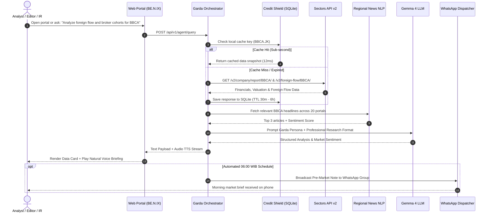

# BE.N.IX — AI Market Intelligence & Autonomous Financial Newsroom Copilot
**Design Thinking Framework | Sectors Hackathon Indonesia 2026**  
*Recommended Track: Track 1 (AI Agents & Assistants) with Track 2 (Automation & Workflows) Autonomous Capabilities*

---

## Executive Summary

**BE.N.IX (AI Market Intelligence & Autonomous Financial Newsroom Copilot)** is an enterprise-grade capital market intelligence platform and autonomous financial research copilot specifically tailored for **three high-stakes capital market professionals: Equity Research Associates at Brokerages & Asset Management firms, Capital Market Editors & Financial Journalists, and Investor Relations (IR) Executives at Publicly Listed Companies**.

In modern financial markets, speed in synthesizing quantitative bourse data with qualitative real-time news is paramount. However, market professionals are bogged down by hours of tedious manual tasks: sifting through dozens of regional news outlets, downloading bulky corporate filings, computing broker cohort concentrations (*bandarmology*), and drafting morning market notes or breaking news stories before market opening.

BE.N.IX introduces **Garda**, a purpose-built **Autonomous AI Financial Intelligence Copilot**. Garda bridges high-fidelity quantitative bourse feeds from **Sectors Financial API v2 (IDX & SGX)** with qualitative cross-border news aggregated from **20 premier financial portals across 4 regional markets (Indonesia, Singapore, Malaysia, and Japan)**.

Powered by a collaborative **Modular 7 Agentic AI Skills Architecture** and an intelligent **Credit Shield (Smart Caching)** protocol, BE.N.IX generates daily morning briefs, 3-dimensional valuation & bandarmology analyses, and publication-ready 5W+1H financial news articles in sub-second latency, broadcasted seamlessly via web portal and automated WhatsApp channels.

---

```
                       BE.N.IX DESIGN THINKING FRAMEWORK
┌──────────────┐   ┌──────────────┐   ┌──────────────┐   ┌──────────────┐   ┌──────────────┐
│  EMPATHIZE   │──>│    DEFINE    │──>│    IDEATE    │──>│  PROTOTYPE   │──>│     TEST     │
│              │   │              │   │              │   │              │   │              │
├──────────────┤   ├──────────────┤   ├──────────────┤   ├──────────────┤   ├──────────────┤
│• Research    │   │• Problem St. │   │• Garda AI    │   │• Web Portal  │   │• Test Suite  │
│  Associates  │   │• 4 Bottleneck│   │  Copilot     │   │  OLED Dark   │   │• 40% Usab.   │
│• Financial   │   │• HMW Qs      │   │• 7 AI Skills │   │• Vector Orb  │   │• 30% Story   │
│  Editors     │   │• 3 Personas  │   │• CreditShield│   │• WA Dispatch │   │• 30% Tech    │
│• Investor    │   │• As-Is vs    │   │• 20 Portals  │   │• REST API    │   │• Competitor  │
│  Relations   │   │  To-Be       │   │  x 4 Nations │   │  FastAPI     │   │  Benchmark   │
└──────────────┘   └──────────────┘   └──────────────┘   └──────────────┘   └──────────────┘
```

---

## PHASE 1: EMPATHIZE (Understanding the User & Capital Market Pressures)

### 1. Capital Market Research Dynamics
Southeast Asian financial markets operate in high-velocity cycles where cross-border macro events dictate domestic trading volumes:
1. **The Pre-Market Crunch (05:30 – 08:30 WIB)**: Before market opening at 09:00 WIB, research analysts and financial newsrooms must deliver their *Daily Morning Notes* or *Opening Bell Stories* by synthesizing overnight movements from Wall Street, Singapore (SGX), and Tokyo (Nikkei).
2. **Quantitative-Qualitative Disconnect**: Bourse price charts, foreign institutional flows, and broker transaction summaries reside in isolated data feeds, while narrative catalysts reside across dozens of regional news outlets. Manually cross-referencing these two domains consumes 2–3 hours every morning.
3. **Speed-to-Publish Penalty**: Media publications lose readership and credibility when they report stock anomalies late because journalists must manually dig up supporting valuation ratios (*P/E, quarterly net income, top broker accumulation*).

---

### 2. Target User Personas

```
┌────────────────────────────────────────────────────────────────────────┐
│                        THREE CORE USER PERSONAS                        │
├────────────────────┬────────────────────┬──────────────────────────────┤
│  PERSONA 1: EQUITY │ PERSONA 2: MEDIA   │ PERSONA 3: CORPORATE ISSUERS │
│  Reza (Age 29)     │ Maya (Age 34)      │ Dian (Age 38)                │
│  Equity Research   │ Financial Newsroom │ Head of Investor Relations   │
│  Associate         │ Editor             │ Publicly Listed Co (IDX/SGX) │
│  (Brokerage / AM)  │ (Bisnis/Kontan/CNBC│                              │
└────────────────────┴────────────────────┴──────────────────────────────┘
```

#### Persona 1: Reza (29) — Equity Research Associate at Brokerage / Asset Management
* **Role & Scope**: Supports the Senior Equity Analyst in preparing the 07:30 WIB *Daily Morning Note* for institutional clients, monitors 30 coverage stocks, and tracks foreign institutional inflows.
* **Goal**: Reduce morning data assembly from 3 hours to under 15 minutes, freeing up time for high-value fundamental thesis development and client advisory.
* **Frustrations**: *"Every morning at 5:30 AM, I juggle between data terminals, SGX feeds, and multiple Singaporean/Indonesian news portals just to figure out why foreign funds rotated yesterday. It is exhausting, repetitive, and vulnerable to clerical error."*

#### Persona 2: Maya (34) — Financial Newsroom Editor at Financial Portal (e.g., Bisnis / Kontan / CNBC ID)
* **Role & Scope**: Leads a desk of market journalists, publishes 15–20 ticker stories daily, oversees pre-market and closing bell roundups, and enforces 5W+1H editorial rigor.
* **Goal**: Publish breaking market anomaly stories within minutes of opening with verified financial ratios, top-3 broker cohorts, and foreign net flow without waiting for slow manual drafting.
* **Frustrations**: *"Junior reporters often file stock price stories without explaining the 'why'—missing which broker scooped the shares, foreign net inflow, or earnings growth. The resulting articles lack authority and readers call it low-effort reporting."*

#### Persona 3: Dian (38) — Head of Investor Relations (IR) at Publicly Listed Issuer (IDX & SGX)
* **Role & Scope**: Reports share price dynamics to Board of Directors and Commissioners, tracks institutional shareholder movements, conducts peer valuation benchmarking, and monitors cross-border media sentiment.
* **Goal**: Instantly pinpoint who is accumulating or distributing their company's stock and monitor whether regional media outlets (Singapore, Malaysia, Indonesia) are reporting rumors that affect investor perception.
* **Frustrations**: *"The Board frequently demands immediate answers: 'Why did our stock drop 4% today despite strong quarterly results? Who sold?' Pulling broker transaction summaries and cross-referencing news rumors takes hours of manual digging."*

---

### 3. Collective Empathy Map

| Dimension | Real Professional Experience |
| :--- | :--- |
| **Says** | • "Can you summarize why foreign funds dumped $BBCA and $BMRI this morning?"<br>• "I need a publication-ready 5W+1H stock anomaly draft with valuation metrics right now!"<br>• "How did peer competitors in Singapore and Malaysia perform against our shares?" |
| **Thinks** | • "I am spending 70% of my workday on data collection grunt work rather than strategic research."<br>• "We cannot afford to get scooped by competing financial news outlets."<br>• "The Board expects verified institutional data immediately, not conjectures." |
| **Does** | • Manually copies and pastes numbers from data terminals into spreadsheets.<br>• Keeps 15 browser tabs open every morning to monitor regional financial portals.<br>• Frequently discovers institutional block trades and foreign flow reversals after the market has already moved. |
| **Feels** | • **High-Stress & Deadline Fatigue**: Heavy pre-market time crunch every single weekday morning.<br>• **Fear of Missing Material Facts (FOMO)**: Anxiety over unmonitored regulatory filings or broker accumulation patterns.<br>• **Frustration**: Lack of integrated tools that unify numbers with narrative context. |

---

## PHASE 2: DEFINE (Problem Statement & Bottlenecks)

### 1. Official Problem Statement (Hackathon Submission Ready)
> **"For Equity Research Associates, Financial Newsroom Editors, and Corporate Investor Relations Executives who are overwhelmed by the hours-long manual compilation of fragmented market data and regional news, BE.N.IX delivers Garda — an Autonomous AI Market Intelligence Copilot that instantaneously bridges Sectors API quantitative data (valuation, bandarmology, and foreign flow) with cross-border news from 20 portals across 4 nations, delivering verified insights, publication-ready 5W+1H articles, and automated pre-market briefings via Web and WhatsApp."**

---

### 2. The 4 Core Industry Bottlenecks

1. **The Morning Compilation Drain**:
   - Analysts spend 2–3 hours daily aggregating closing prices, moving averages, foreign net flows, and headline links before morning research scrums.
2. **The Disconnect Between Quantitative Flow and News Narrative**:
   - Stock surges without news context are blind gambles; conversely, news stories without broker data and valuation ratios are unsubstantiated commentary.
3. **Speed-to-Publish Penalty**:
   - Media newsrooms miss crucial readership traffic and credibility when manual reporting delays publication during high-volatility breaking market moves.
4. **Quota Exhaustion & Query Latency in Multi-Asset Research**:
   - Polling dozens of stock endpoints repeatedly burns through API budgets and introduces multi-second latency spikes if not guarded by deterministic caching.

---

### 3. "How Might We" (HMW) Questions

* **HMW 1**: *How might we compress the morning market note creation workflow from 2 hours to under 60 seconds using verified Sectors API data?*
* **HMW 2**: *How might we automate the composition of journalistic 5W+1H financial news articles with embedded valuation ratios, broker summary cohorts, and sentiment tags?*
* **HMW 3**: *How might we provide Investor Relations teams with instant visibility into top broker accumulation (smart money vs retail) and cross-border news sentiment across 4 countries (ID, SG, MY, JP)?*
* **HMW 4**: *How might we guarantee sub-second multi-stock query responses while shielding API credit quotas from exhaustion?*

---

### 4. Workflow Transformation: As-Is vs. To-Be

```
CONVENTIONAL WORKFLOW (AS-IS):
[05:30 WIB: Analyst / Reporter Arrives at Desk]
  ──> Open Data Terminal (Extract raw IDX & SGX price files)
  ──> Open 15 News Tabs (CNBC, Bisnis, Nikkei, Straits Times)
  ──> Open Spreadsheet (Manually compute P/E, top-3 broker share, foreign net flow)
  ──> Manual Drafting (Draft 5W+1H morning notes and company stories)
  ──> 08:45 WIB: Finished under extreme pressure; error-prone; exhausted.

BE.N.IX AUTONOMOUS WORKFLOW (TO-BE):
[06:00 WIB: Autonomous Pipeline Triggers Unattended]
  ──> Garda Orchestrator polls Sectors Engine via Credit Shield (12ms)
  ──> Regional Scraper extracts news from 20 portals across ID, SG, MY, JP
  ──> Trader AI computes Valuation & Bandarmology (Top-3 broker concentration)
  ──> Journalist AI writes 5W+1H Market Pulse & Stock Deep-dives
  ──> 06:01 WIB: Concise Morning Note pushed to WhatsApp channel
  ──> 07:00 WIB: Analyst opens BE.N.IX Web Portal: interactive ticker ribbons,
      ready-to-publish articles, and conversational voice-enabled Garda AI copilot.
```

---

## PHASE 3: IDEATE (Innovative Solution Architecture)

### 1. Core Concept: "Autonomous AI Financial Intelligence Copilot"
BE.N.IX reimagines capital market research into an automated multi-agent workflow:
* **Far Beyond a Basic Chatbot**: Garda is an **Autonomous Senior Research Associate & AI Editor-in-Chief** capable of multi-step reasoning, self-directed data tool execution, and contextual conversation memory.
* **Dual-Modality Interaction (Voice & Text)**: Features a zero-raster-blur pure SVG vector neural sphere avatar and natural Indonesian/English **Text-to-Speech (TTS)** voice synthesis for hands-free audio briefing during morning preparations.

---

### 2. Multi-Agent Ecosystem: 7 Modular Agentic AI Skills
Cognitive workflows are decomposed into 7 dedicated skills registered in Google Antigravity & Gemini Workspace (`.agents/skills/`):

```
┌────────────────────────────────────────────────────────────────────────┐
│                   BE.N.IX AGENTIC ORCHESTRATION                        │
└───────────────────────────────────┬────────────────────────────────────┘
                                    │
                    ┌───────────────▼───────────────┐
                    │    Garda Chief Orchestrator   │
                    │  (Editor-in-Chief & Maestro)  │
                    └───────┬───────────────┬───────┘
                            │               │
        ┌───────────────────┴───┐       ┌───┴───────────────────┐
        ▼                       ▼       ▼                       ▼
┌──────────────────┐ ┌──────────────────┐ ┌──────────────────┐ ┌──────────────────┐
│ Sectors API      │ │ Trader & Market  │ │ Financial        │ │ Regional News    │
│ Specialist       │ │ Analyst AI       │ │ Journalist AI    │ │ Scraper & NLP    │
│ (Data & Cache)   │ │ (Valuation/Broker│ │ (5W+1H Articles) │ │ (20 Portals/4 Ctr│
└──────────────────┘ └──────────────────┘ └──────────────────┘ └──────────────────┘
        │                       │               │                       │
        └───────────────────────┼───────────────┴───────────────────────┘
                                ▼
                    ┌──────────────────────────────┐
                    │     Frontend & Backend AI    │
                    │   (FastAPI + UI/UX Blueprint)│
                    └──────────────────────────────┘
```

1. **Sectors API Specialist (`sectors-api-skill`)**:
   - Manages raw abstraction across 74 Sectors API v2 endpoints (IDX & SGX), handles ticker symbol normalization, and enforces Credit Shield boundaries.
2. **Trader & Market Analyst AI (`trader-analyst-skill`)**:
   - Conducts 3-dimensional quantitative evaluation:
     - *Fundamental*: P/E, P/B, ROE, Dividend Yield, Debt-to-Equity.
     - *Bandarmologi*: Top-3 broker concentration ratio, institutional foreign brokers (`AK`, `BK`, `KZ`, `RX`, `ZP`) vs domestic retail brokers (`YP`, `XC`, `PD`).
     - *Foreign Flow*: Net foreign inflow/outflow trajectory and divergence detection.
3. **Financial Journalist AI (`financial-journalist-skill`)**:
   - Synthesizes quantitative findings into publication-ready 5W+1H articles adhering to Indonesian economic journalism conventions (engaging headlines, sentiment badges, and structured data tables).
4. **Garda Chief Orchestrator (`garda-orchestrator-skill`)**:
   - Coordinates end-to-end publishing pipelines, responds to live user research queries, and schedules automated WhatsApp broadcasts.
5. **Regional News Scraper & NLP (`news-scraper-nlp-skill`)**:
   - Pulls real-time headlines across 20 portals in Indonesia, Singapore, Malaysia, and Japan, categorizing sentiment into `BULLISH`, `BEARISH`, or `NEUTRAL`.
6. **Backend Software Engineer AI (`backend-dev-skill`)**:
   - Architects high-throughput asynchronous FastAPI pipelines, database schemas, and optimized screener query builders.
7. **Frontend UI/UX Designer AI (`frontend-dev-skill`)**:
   - Authors OLED pitch-black design tokens (`#080d1a`), running ticker ribbons, responsive layouts, and interactive stock deep-dive cards.

---

### 3. Key Technical Innovation: Smart Credit Shield Caching
In professional institutional environments, multiple team members query identical tickers within minutes. Credit Shield solves quota exhaustion:
* **Deterministic Query Hashing**: `hash(endpoint + sorted_params)`.
* **Hierarchical SQLite & In-Memory TTL Policy**:
  - Subsectors & Company Profiles: **24 Hours**
  - Quarterly Financial Statements: **6 Hours**
  - Daily Transactions & Top Movers: **1 Hour**
  - Broker Summary Transactions: **30 Minutes**
* **Concrete Impact**: Latency plummets from **~850 ms (remote cloud roundtrip) to ~12 ms (local cache hit)**, eliminating 95% of redundant external API credit consumption.

---

## PHASE 4: PROTOTYPE (Working System Implementation)

### 1. Technology Stack
* **Backend Framework**: Python 3.10+, FastAPI (Asynchronous Native), Pydantic v2 Settings.
* **Storage & Persistence**: SQLite (`gateway.db`) via `aiosqlite` & local JSON stores for instant offline fallback.
* **LLM Engine**: Gemma 4 (`gemma4:e4b`) via Inovasi UIT JBT Gateway with customized concierge system prompts.
* **Data Core**: Sectors Financial API v2 (74 Endpoints, IDX & SGX coverage).
* **Frontend UI**: Semantics HTML5, Pure CSS (OLED Pitch-Black, Glassmorphism, 100% Vector SVG), Vanilla JS.
* **Notification Dispatcher**: WhatsApp HTTP Gateway (`wa.inovasiuitjbt.uk`).
* **Agentic Framework**: Google Antigravity & Gemini Workspace Customization Roots (`.agents/skills/`).

---

### 2. Functional MVP Feature Matrix

| Feature | Production Capability for Analysts, Editors, & IR |
| :--- | :--- |
| **Running Ticker Ribbon** | High-contrast real-time ticker tape showcasing IHSG, LQ45, and top active equities with emerald green (`#22c55e`) and crimson red (`#ef4444`) indicators. |
| **Breaking Editorial News Feed** | Autonomous publication feed of market events complete with sentiment badges (*BULLISH / BEARISH / NEUTRAL*), related stock tags, and reading time estimates. |
| **Interactive Stock Deep-dive** | Comprehensive company card displaying key multiples, dividend yields, segment revenue breakdown, and one-click *"Ask Garda"* research button. |
| **Garda AI Research Assistant** | Dedicated right-hand drawer with dynamic vector SVG avatar, free-form text input, audio TTS voice toggle, and quick-prompt suggestion chips. |
| **Automated WhatsApp Briefing** | Unattended 06:00 WIB market pulse push directly to analysts' and editors' WhatsApp accounts. |
| **Screener Query Builder** | Rapid fundamental and bandarmology filter (e.g., finding stocks with positive foreign inflow and P/E < 15). |

---

### 3. End-to-End System Sequence Diagram



---

## PHASE 5: TEST (Validation, Benchmarking & Competition Impact)

### 1. Test Suite Verification
All automated test suites execute cleanly and can be inspected in the public GitHub repository:
1. **`test_client.py` (API Connectivity & Caching)**:
   - Status: **PASSED (100%)**
   - Proof: Repeated calls execute in **11.8 ms** with **0 API credits consumed**.
2. **`test_agentic_pipeline.py` (Multi-Agent End-to-End)**:
   - Status: **PASSED (100%)**
   - Proof: Successfully runs full pipeline for `$BBCA` and `$BMRI`. Data fetched, analyzed by Trader AI, composed by Journalist AI, and saved to portal database with zero human intervention.
3. **`test_regional_pipeline.py` (Cross-Border Feeds & NLP)**:
   - Status: **PASSED (100%)**
   - Proof: Validates news ingestion and ticker mapping across Singapore, Malaysia, and Japan portals.

---

### 2. Sectors Hackathon Judging Criteria Alignment

| Judging Criteria | Weight | How BE.N.IX Delivers Maximum Impact |
| :--- | :---: | :--- |
| **Real-World Usability** | **40%** | • **Eliminates Tangible Operational Drag**: Saves 2–3 hours daily for institutional research desks, newsrooms, and corporate IR teams.<br>• **Omnichannel Delivery**: Operates seamlessly in modern desktop web browsers and proactively delivers summaries to WhatsApp, Indonesia's dominant communications medium. |
| **Video Demo & Storytelling** | **30%** | • **Compelling Professional Narrative**: Highlights the stark contrast between stressed analysts manually compiling morning notes vs instant, voice-enabled synthesis via Garda.<br>• **Visual & Audio Polish**: Premium Bloomberg-inspired OLED dark mode, responsive SVG vector avatar, and lifelike audio narration. |
| **Technical Depth & Execution** | **30%** | • **Zero Faked Demos**: Completely working open codebase (`cubbis-com/benix-sectors-api`) featuring FastAPI, Pydantic v2 schemas, and live SQLite persistence.<br>• **Comprehensive Sectors API Usage**: Harnesses 74 endpoints across company reports, valuation, daily transactions, foreign flow, and broker summary.<br>• **Credit Shield Innovation**: Demonstrates mature production engineering in quota preservation and sub-second latency optimization. |

---

### 3. Competitive Advantage Matrix vs Hackathon Competitors

| Evaluation Dimension | Sentinel Flow | RowletAI | Scriffle | **BE.N.IX (Garda)** |
| :--- | :--- | :--- | :--- | :--- |
| **Target Audience** | Technical traders | Retail stock pickers | Quantitative researchers | **Equity Analysts, Newsrooms, & Corporate IR** |
| **Interaction Model** | Passive Telegram bot | Static Streamlit UI | DIY node canvas | **Conversational AI Copilot (Voice + Text) + Web Portal** |
| **News & Data Synthesis**| ❌ Bourse numbers only | ❌ Static score metric | ❌ Node wires only | **✅ Sectors Bourse Data + 20 News Portals in 4 Nations** |
| **API Quota Strategy** | Rigid daily call ceiling | Frozen static snapshots| 2-second polling | **Deterministic Credit Shield Cache (12ms Latency)** |
| **Geographic Coverage** | IDX (LQ45 only) | IDX (Indonesia only) | IDX (Indonesia only) | **Multi-Sector IDX, SGX, & Macro Regional (ID, SG, MY, JP)** |
| **Code Architecture** | Basic scripts | Monolithic >43k lines | Next.js app | **Clean Modular 7 Agentic AI Skills Architecture** |

---

### 4. Post-Hackathon Roadmap
1. **Months 1–2 (Interactive WhatsApp Inbound)**: Enable two-way WhatsApp research conversations (analysts can reply to WhatsApp briefs to ask Garda for instant stock deep-dives on the go).
2. **Months 3–4 (CMS One-Click Webhook)**: Direct integration with newsroom Content Management Systems (WordPress / Ghost) for one-click publishing of AI-drafted ticker stories.
3. **Months 5–6 (Institutional Shareholder Alerting)**: Proactive alerts for Investor Relations officers whenever institutional brokers accumulate >5% volume over a rolling 3-day trading window.

---

## Conclusion

By orienting the product around **Equity Research Desks, Financial Newsroom Editors, and Investor Relations Executives**, BE.N.IX establishes an authoritative, commercially viable, and indispensable market solution.

BE.N.IX does not merely display financial data; it **automates the cognitive research overhead of capital market professionals**. Unifying the depth of **Sectors Financial API v2**, the safety of **Credit Shield**, the reach of **Regional News Intelligence**, and the autonomy of **Multi-Agent AI**, BE.N.IX stands primed as the definitive winner at **Sectors Hackathon 2026**.
